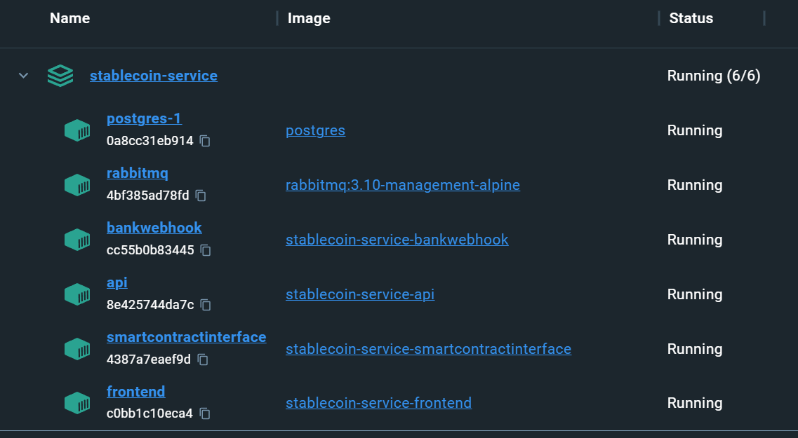
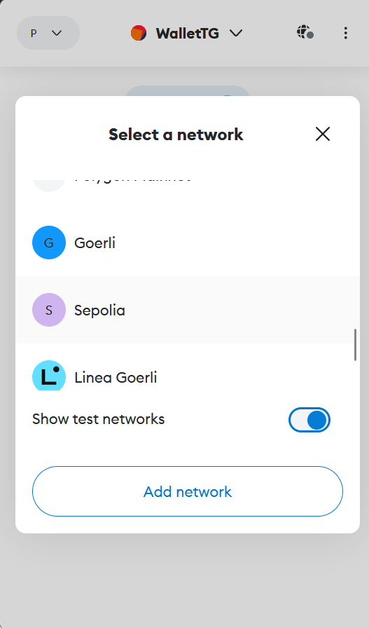
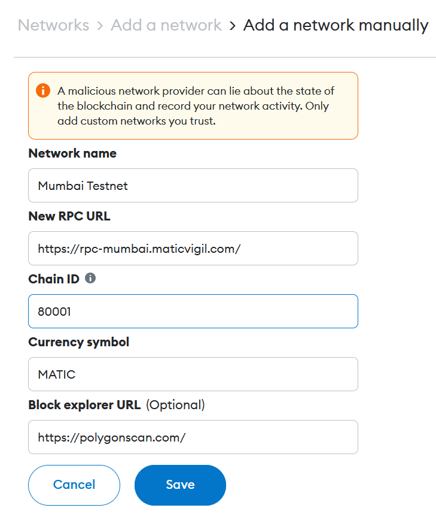

# LAUNCHING A STABLECOIN WITH CROSS-CHAIN INTEROPERABILITY

## This repository supports my Final Work of Undergraduation Study

### Steps to reproduce the results

- First, make sure you have Docker Engine, Docker CLI and Docker Compose installed. 
You can find the instructions to do so at https://docs.docker.com/compose/install/
- Clone this repository somewhere you want:
```
git clone https://github.com/EricBastos/ProjetoTG.git
```
- You might need to grant permission to execute the local.sh script. To do so, execute:
```
chmod +x local.sh
```
- Simply execute local.sh, and, if you have docker set up correctly, it'll create and start all the containers
necessary to test the code.
```
./local.sh
```
- P.S.: If you're using windows, you can reproduce the exact same steps above if you do everything inside WSL. 
If you're not using WSL, you might have to manually execute the commands inside local.sh in your command line, 
or use the PowerShell. It should work as long as docker is properly set up.

If everything worked correctly, you should have 6 containers running:



The API is available at localhost:8080, and a simple Frontend which you can use to visually interact with the basic
functionalities of the API is available at localhost:80. A RabbitMQ and a Postgres instance are deployed along with the system.

The database is not exposed to the host machine, but you can access it by entering its containers, if you want to check 
the database tables. 

The RabbitMQ instance, on the other hand, exposes a port at localhost:8888, which is its visual
interface. Log in using the following credentials:
```
user: rabbitmq
password: rabbitmqpassword
```

Accessing this interface, you can see pretty much all the information related to the queues, the exchanges, the messages
and the consumers. It's also possible to manually post messages, but they have to follow a basic structure to be processed.

Some parameters can be configured in the .env file, such as the RPC hosts for Sepolia and Mumbai network,
the StableCoin contract addresses for both networks, and the deployer wallet private and public keys for both networks as well.
Other parameters shouldn't really be changed unless you know what you are doing. If you change any parameters, be sure to run
the local.sh script again to compile and update everything.

### Deploying your own StableCoin smart contract

The .env file is filled in with a disposable wallet which I filled with some testnet tokens just for the sake of 
testing this project. You might want to use your own wallet and deploy your own smart contract for your own testing. 
To do so, you can follow the steps below where I show how to use the remix IDE for that purpose:

1. **Go to https://remix.ethereum.org**

Remix is a very user-friendly IDE and allows for a quick deploy of the contracts. Open the StableCoin_Flattened.sol file
in the IDE. You can find this file in SmartContractInterface/internal/smartContract. This is the Stable Coin smart contract
with all the libraries embedded in a single file. The actual Stable Coin smart contract code can be found in the bottom
of the file.

2. **Inject the Metamask Provider**

In the Deploy & Run Transactions section, change the environment to Injected Provider - Metamask. Now you can simply change
which Metamask wallet you are using to deploy the contract. Just make sure to do so while you're in a Testnet network,
although you can deploy the contract in Mainnet at the cost of real money. You'll also need some native tokens, which can
be received from a faucet if you're using a Tesnet.

3. **Choose the correct contract**

Still in the Deploy & Run Transactions section, choose the correct Contract from the list: StableCoin - StableCoin_flattened.sol.
All the others are the embedded libraries and shouldn't be compiled.

4. **Deploy**

Simply click Deploy, accept the transaction in Metamask, and wait for the contract to be deployed. If everything worked,
you should have the newly deployed contract address in the Deployed Contracts section.

5. **Adjusting the .env file**

After deploying your own contract in Mumbai and Sepolia network, you should have the contract address for both networks.
Copy and paste these addresses into the .env file (ETH_CONTRACT_ADDRESS and POLYGON_CONTRACT_ADDRESS). You also should
have the public and private keys of the wallet you used to deploy the contracts. The public key is simply your wallet
address, whereas the private key can be exported in the Metamask app. Paste those values into ETH_PRIVATE_KEY, ETH_PUBLIC_KEY,
POLYGON_PRIVATE_KEY and POLYGON_PUBLIC_KEY.

### Using the Frontend interface

One of the running containers should be the Frontend. It exposes a simple website in localhost:80 to easily test the API
endpoints. The interface is pretty self-explanatory, but some prior Metamask configuration is needed, which is basically
what this topic covers.

We first assume that Metamask is installed. If you're using Firefox or Google Chrome, you can simply install the Metamask
extension and follow the basic initial setup.

Now, open the Metamask interface and click on the network button on the left side of your wallet name. In the "Select a network"
window that should pop up, choose to show the Test Networks (this will automatically add the Sepolia network to the list),
and then click on the Add Network button.



You should be redirected to another window, where you can add a network manually. Click this button and fill all the fields
with the following information to add the Polygon Mumbai Tesnet:

Network Name: Mumbai Testnet \
New RPC URL: https://rpc-mumbai.maticvigil.com/ \
Chain ID: 80001 \
Currency Symbol: MATIC \
Block Explorer URL: https://polygonscan.com/ 



Now, with Metamask installed and both the Sepolia and Mumbai test networks added, you're ready to use the Frontend app.
Make sure to use one of these networks while interacting with the frontend, otherwise it'll tell you to switch to a valid
network, since the backend supports only these two networks.